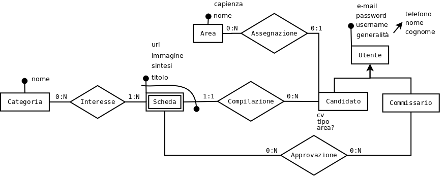
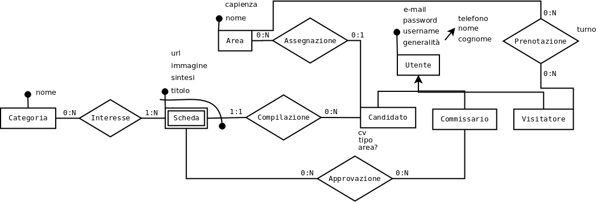

# Soluzione seconda prova [straordinaria 2017](http://www.istruzione.it/esame_di_stato/201617/Istituti%20tecnici/Straordinaria/I044_STR17.pdf)

## Analisi realtà e ipotesi aggiuntive
La traccia presenta alcune problematiche dovute alle diverse tipologie di utenti della piattaforma online ed alla possibilità di caricare file che potranno essere visualizzati da altri utenti.  
Si introduce la seguente terminologia per distinguere le tipologie di utenti:
* *candidato*: utente registrato che intende sottoporre le proprie eventuali schede di candidatura (inizialmente nessuna!)
* *commissario*: utente registrato facente parte del personale dell'associazione
* *espositore*: candidato con almeno una scheda accettata dalla commissione, cui viene assegnata un'area (si suppone unica indipendentemente dal numero di schede accettate)
* *utente*: utente generico (non registrato) che visualizza il contenuto pubblico della piattaforma
* *visitatore*: (vedi seconda parte I) utente registrato che intende prenotare una visita

e, secondo quanto indicato dalla traccia:
* *scheda*: scheda di candidatura non (ancora) accettata dalla commissione e quindi passibile di revisione (vedi seconda parte II)
* *contributo*: scheda di candidatura accettata dalla commissione (si intende che la candidatura sia accettata se lo è da almeno un commissario, senza prevedere possibilità di indicazione esplicita di "rifiuto" da parte dei commissari)

Come architettura generale di sistema, la traccia sembra suggerire una classica architettura di applicazione web con browser come front-end, server web che svolge anche le funzioni di server applicativo e DBMS per la persistenza dei dati.
## Progettazione base di dati
Per la notazione utilizzata, vedasi [legenda](../legenda.md)
### Progettazione concettuale
Sembra utile introdurre una gerarchia is-A per le tipologie di utenti (salvo utente che non interessa), secondo le tipologie precedentemente illustrate.  
Per la gestione dei file allegati (cv e immagini), trattandosi di materiale che potrebbe diventare di accesso pubblico, non si ritiene necessario adottare particolari misure di sicurezza (prima di diventare di accesso pubblico, essi saranno vagliati dalla commissione).  
Risulta quindi accettabile una soluzione che preveda la memorizzazione di tali file in un'apposita directory del server web, assegnando nomi univoci memorizzati nel database; ciò consente anche una riduzione del traffico tra server web e DBMS. Si può anche pensare ad una eliminazione degli allegati non significativi (ad es. schede non accettate).  
Uno schema E-R di massima risulta quindi il seguente:
  
in cui al momento non si considera il visitatore e l'espositore non è esplicitato in quanto si tratta di un candidato con (almeno) una scheda approvata ed un'area assegnata.  
Per immagine e cv si intendono dei riferimenti (univoci) ai rispettivi file.
Anche se non necessari, si considerano attributi comuni a tutte le tipologie di utenti e-mail, telefono.

Possibili varianti sono:
* attributo approvata in scheda, inizialmente NULL/false e da aggiornare in seguito, in sostituzione dell'associazione Approvazione (magari dopo la conclusione della fase di esame delle schede)
* ...

### Progettazione logica
Si anticipa l'introduzione di chiavi surrogate laddove utile per efficienza e comodità.  
(si veda lo [script di creazione](DBSTR17.sql))
### Progettazione fisica
Oltre alla già anticipata introduzione di chiavi surrogate, per questioni di efficienza si possono introdurre indici per facilitare le ricerche, oltre a quelli automatici per le chiavi primarie ed esterne.  
Indici:
* per utente: alfabetico(cognome, nome), unique(username), ...

Si inserisce il codice per la creazione del database richiesto dalla seconda parte punto II della traccia (basterebbe, ad es., CoPresenza o Assenza):
## Interrogazioni in linguaggio SQL
### a) elenco degli espositori, in ordine alfabetico per cognome e nome con l’area a cui sono assegnati
Si suppone non interessi altro oltre a ciò che è esplicitamente richiesto.
````sql
SELECT u.cognome, u.nome, a.nome
    FROM Candidato c
        JOIN Utente u ON (c.id = u.id)
        JOIN Area a ON(a.id = c.area)
    ORDER BY u.cognome, u.nome;
````
### b) elenco delle esposizioni di una certa categoria di classificazione, con indicazione del titolo, cognome e nome dell’espositore e area di esposizione
Si suppone nota l'id della categoria, della quale non interessa il nome; per esposizioni si intende il titolo della scheda.
````sql
SET @CATEGORY = 1;
SELECT s.titolo, u.cognome, u.nome, a.nome
    FROM Interesse i
        JOIN Scheda s ON (i.scheda = s.id)
        JOIN Candidato c ON (s.candidato = c.id)
        JOIN Utente u ON (c.id = u.id)
        JOIN Area a ON (c.area = a.id)
    WHERE i.categoria = @CATEGORY
    ; -- ORDER BY what ???;
````
### c) l’elenco delle categorie di classificazione, in ordine decrescente per il numero di espositori
Si suppone interessi anche il numero di espositori, solo maggiore di zero.  
````sql
SELECT c.nome, COUNT(DISTINCT e.id) AS NumEspositori -- Espositore counts only once
    FROM Categoria c
        JOIN Interesse i ON (c.id = i.categoria)
        JOIN Scheda s ON (i.scheda = s.id)
        JOIN Approvazione a ON (s.id = a.scheda)
        JOIN Candidato e ON (e.id = s.candidato)
    GROUP BY c.id
    ORDER BY COUNT(DISTINCT e.id) DESC;
````
## Progettazione pagine web
* [ ] to be done

## Seconda parte
### I

Si riporta il diagramma E-R aggiornato per tener conto delle prenotazioni:

Naturalmente il vincolo di capienza massima è imposto tramite un trigger.  
Il turno può essere orario o altro, ...
Il resto si lascia per esercizio al lettore ;-)
### II
Si lascia per esercizio al lettore ;-)
### III
* [ ] To AJAX Or Not To AJAX, this is the question ...
### IV
* [ ] That's really interesting...
First things first, what do you mean by DB administrator?  
Is he/she a single DB administrator?  
Is he/she the DBMS administrator?  
... ....