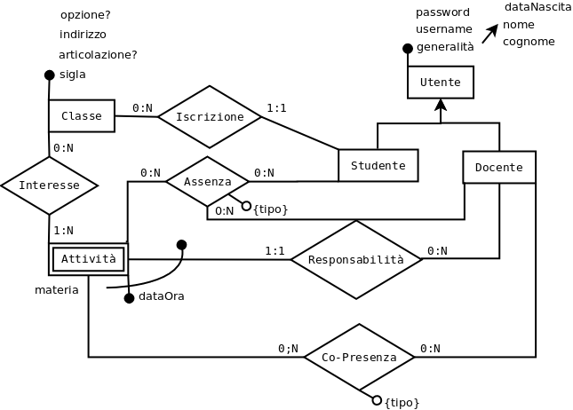
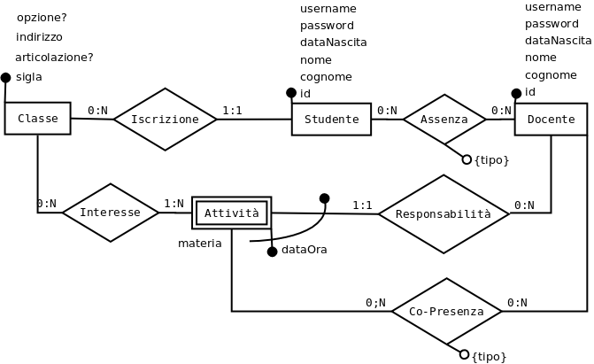

# Soluzione seconda prova [suppletiva 2017](http://www.istruzione.it/esame_di_stato/201617/Istituti%20tecnici/Suppletiva/I044_SUP17.pdf)

## Analisi realtà e ipotesi aggiuntive
La realtà oggetto della prova è molto complessa e presenta svariate situazioni particolari (supplenze, visite/viaggi d'istruzione, attività alternative, ...) che rendono difficile un'analisi completa.
Si fanno quindi delle ipotesi semplificative per ridurre l'ambito dell'analisi:
* i dati si riferiscono ad un unico anno scolastico
* tutti gli studenti di una classe partecipano alle medesime attività (= ore di lezione)
* tutte le attività hanno una durata di un'ora: attività con durata di n ore sono registrate come n attivitò separate
* ciascuna attività (non sovrapposta ad altre) ha un docente "responsabile" che la registra, mentre i docenti "co-presenti" possono solo firmare la loro presenza ad attività già inserite
* non si considerano entrate/uscite se non all'inzio/fine di un'ora
* i docenti "principali" possono indicare qualunque materia, indipendentemente dalla composizione della loro cattedra
* la password per l'accesso ai dati di uno studente è unica (valevole per lo studente ed i suoi genitori)
* ...

In particolare, l'ingresso in ritardo e l'uscita anticipata possono coesistere nella stessa data, e l'ingresso in ritardo è probabilmente registrato dopo un'assenza totale, che quindi non risulta più tale e può essere eliminata.
## Progettazione base di dati
Per la notazione utilizzata, vedasi [legenda](../legenda.md)
### Progettazione concettuale
La traccia stessa suggerisce l'introduzione di alcune  entità fondamentali dell'applicazione: Studente, Classe, Docente.
Le attività (ore di lezione) possono essere considerate un'entità debole posseduta da Docente.  
Risulta quindi utile partire da tali entità per realizzare il diagramma E-R che risulta:


Sono presenti le entità:
* Classe(**sigla**, indirizzo, articolazione?, opzione?)
* Studente(**{generalità}**, username!, password)
* Docente(**{generalità}**, username!, password)
* Attività(**(data, ora)**, materia) debole posseduta dal docente responsabile

(dove con {generalità} si sono indicati gli attributi generali quali nome, cognome, data di Nascita, ... sufficienti ad identificare la persona e con {tipo} quelli necessari ad identificare l'assenza; ingresso/ora, uscita/ora, giorno intero oppure il tipo di Co-Presenza: laboratorio, sostegno, etc.)    
e le seguenti associazioni:
* (Classe 0:N) <- Iscrizione -> (1:1 Studente)
* (Classe 0:N) <- Interesse -> (1:N Attività)
* (Docente 0:N) <- Responsabilità -> (1:1 Attività)
* (Docente 0:N) <- Co-Presenza(tipo) -> 0:N Attività)
* (Studente 0:N) <- Assenza(tipo) -> (0:N Docente)
* (Attività 0:N) <-|

Si noti che:
* Interesse permette di gestire ad esempio lezioni per classi articolate, conferenze per diverse classi, ...
* Co-Presenza permette di gestire ad esempio lezioni con nessun co-docente oppure più co-docenti
* Assenza è legata alla singola attività anche tramite Studente, Iscrizione, Classe ed Interesse quindi può essere evitata la partecipazione di Attività ad Assenza
* Data la similitudine tra le entità Studente e Docente, si è inserita un'entità generica Utente, di cui Studente e Docente sono specializzazioni, con gli attributi comuni: Utente(**{generalità})**, username!, password), 

Possibili varianti sono:
* specializzazione di Assenza
* ...

### Progettazione logica
Si ristruttura lo schema evitando la partecipazione di Attività all'associazione Assenza, introducendo chiavi surrogate in Studente e Docente che si separano eliminando la gerarchia is-A data la presenza di associazioni separate per Studente e Docente, arrivando così al seguente schema:


La traduzione porta a queste relazioni:
* Classe(**sigla**, indirizzo, articolazione?, opzione?)
* Studente(**id**,(cognome, nome, dataNascita), username!, password, *classe*)
* Docente(**id**,(cognome, nome, dataNascita), username!, password)
* Attività(**(dataOra, *responsabile*)**, materia)
* Interesse(**(*attività*, *classe*)**)
* CoPresenza(**(*attività*, *docente*)**, tipo)
* Assenza(**(*studente*, data, tipo, *docente*)**, ora?)

Si noti che in Assenza è ridondante l'attributo docente in chiave primaria, poiché non è possibile (desiderabile) che la stessa assenza di un dato studente sia registrata più volte da diversi docenti.  
Inoltre sarebbe opportuno che, per uno stesso studente e la stessa data, non possano essere registrate due assenze se non di tipo I e U. Ciò si può ottenere tramite opportuni trigger oppure con due attributi aggiuntivi e due vincoli UNIQUE (si veda lo [script di creazione](DBSUP17.sql))

### Progettazione fisica
Oltre alla già anticipata introduzione di chiavi surrogate, per questioni di efficienza si possono introdurre indici per facilitare le ricerche, oltre a quelli automatici per le chiavi primarie ed esterne.  
Indici:
* per Studente e Docente: alfabetico(cognome, nome), unique(username), ...

Si inserisce il codice per la creazione del database richiesto dalla seconda parte punto II della traccia (basterebbe, ad es., CoPresenza o Assenza):
[script di creazione schema](DBSUP17.sql), [script di inserimento dati di prova](DBSUP17.data.sql).
## Interrogazioni in linguaggio SQL
Vedasi [script di esecuzione queries](DBSUP17.quey.sql).
### a. elencare tutte le assenze dall’inizio dell’anno di un certo studente con la relativa data
Si suppone non interessi il docente registrante, nè le attività coinvolte, ma solo la data, il tipo e l'eventuale ora.
````sql
SET @STUDENTE = 1;
SELECT data, tipo, IFNULL(ora, 'N/D')
    FROM Assenza
    WHERE studente = @STUDENTE
    ORDER BY data, tipo;
````
### b. elencare gli studenti che non hanno mai fatto assenze
Si suppone interessino le generalità complete e magari la classe degli studenti.
````sql
SELECT c.sigla, s.cognome, s.nome, s.nascita
    FROM Studente s JOIN Classe c ON(c.sigla = s.classe)
    WHERE NOT EXISTS ( SELECT 1 FROM Assenza WHERE studente = id )
    ORDER BY c.sigla, s.cognome, s.nome, s.nascita;
````
### c. visualizzare l’elenco degli studenti che hanno superato un certo numero di ore di assenza, riportando cognome, nome e classe di appartenenza
Si suppone interessi anche il numero di ore di assenza.  
Si noti che, per le assenze di una certa data, le ore di assenza sono:
* il numero di attività se tipo = 'G'
* il numero di attività con ora inizio < ora assenza se tipo = 'I'
* il numero di attività con ora inizio >= ora assenza se tipo = 'U'
* la somma degli ultimi due se presenti entrambi.
````sql
SET @LIMITE = 10;
SELECT c.sigla, s.cognome, s.nome, s.nascita, COUNT(*) AS OreAssenza
    FROM Studente s
        JOIN Classe c ON(c.sigla = s.classe)
        JOIN Interesse i ON(c.sigla = i.classe)
        JOIN Attivita l USING (dataOra, responsabile)
        JOIN Assenza a ON(s.id = a.studente)
    WHERE a.data = DATE(l.dataOra) AND
        (a.tipo = 'G' OR
         (a.tipo = 'I' AND TIME(l.dataOra) < a.ora) OR
         (a.tipo = 'U' AND TIME(l.dataOra) >= a.ora))
    GROUP BY s.id
    HAVING COUNT(*) > @LIMITE
    ORDER BY c.sigla, s.cognome, s.nome, s.nascita;
````
## Progettazione pagine web
* [ ] to be done

## Seconda parte
### I
Si lascia per esercizio al lettore ;-)
### II
Già fatto. Si spera che per vincoli di dominio nessuno intenda soltanto il tipo di dati e/o (NOT) NULL.
#### a) il totale delle ore di lezione fatte da ciascun docente per ogni materia che insegna, ordinando i dati per docente e materia insegnata
Questa query si presta a qualche ambiguità: non è chiaro se per materia insegnata si intenda solo quella per cui il docente firma come responsabile oppure qualsiasi.
Nella prima ipotesi si ha:
````sql
SELECT d.id, d.cognome, d.nome, a.materia, COUNT(*) as ore
    FROM Docente d JOIN Attivita a ON (a.responsabile = d.id)
    GROUP BY d.id, a.materia
    ORDER BY d.cognome, d.nome, d.id, a.materia;
````
Nella seconda la query è simile ma è necessario unire i dati della tabella Attivita a quelli derivanti da CoPresenza, ad esempio tramite una view con UNION.
#### b) visualizzare per ciascuna classe la media delle ore di assenza
Conviene creare una view basata sulla query c della prima parte, leggermente modificata per includere anche gli studenti senza assenze:
````sql
CREATE OR REPLACE VIEW ClasseStudenteAssenze AS
    SELECT c.sigla, s.id, COUNT(a.data) AS OreAssenza
        FROM Studente s
            JOIN Classe c ON(c.sigla = s.classe)
            JOIN Interesse i ON(c.sigla = i.classe)
            JOIN Attivita l USING (dataOra, responsabile)
            LEFT JOIN Assenza a ON(s.id = a.studente)
        WHERE a.data IS NULL OR
            (a.data = DATE(l.dataOra) AND
                (a.tipo = 'G' OR
                (a.tipo = 'I' AND TIME(l.dataOra) < a.ora) OR
                (a.tipo = 'U' AND TIME(l.dataOra) >= a.ora)))
        GROUP BY s.id;
````
E successivamente la query è relativamente semplice:
````sql
SELECT sigla, AVG(OreAssenza) AS media
    FROM ClasseStudenteAssenze
    GROUP BY sigla;
````
### III
* [ ] La soluzione di questo quesito ...
### IV
* [ ] La soluzione di questo quesito ...
