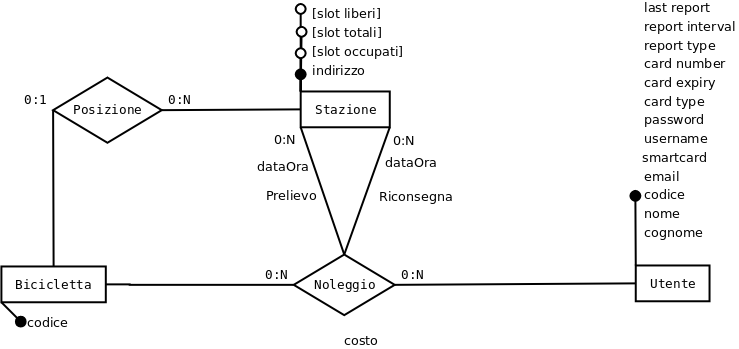
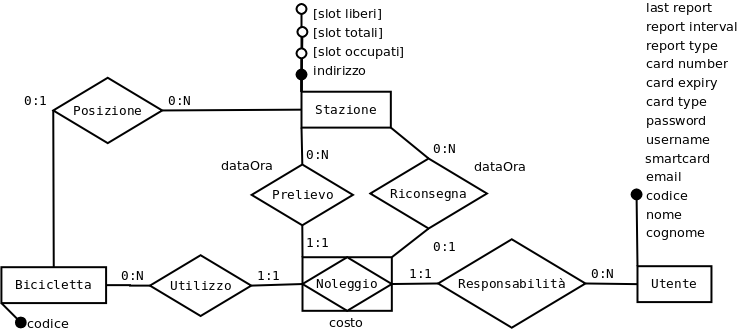

# Soluzione esempio seconda prova
N.B. si riporta la soluzione della sola parte informatica
## Ipotesi aggiuntive
* Il testo sembra chiaro tranne che per la definizione dei costi.
* Non interessa granché la modalità di consegna della smartcard, salvo una eventuale registrazione dell'avvenuta consegna.
* Il numero di utenti può essere stimato in base al numero di abitanti della città in qualche decina di migliaia.
* Analogamente il numero di stazioni sarà di qualche decina e di conseguenza il numero di biciclette al massimo di un migliaio circa.
* Di conseguenza il numero di noleggi potrà essere circa un migliaio al giorno.
## Progettazione base di dati
### Legenda notazione utilizzata
Per la notazione utilizzata, vedasi [legenda](../legenda.md)
### Progettazione concettuale
Nota preliminare:  
Considerare separatamente il Prelievo e la Riconsegna, sebben possibile, crea solo complicazioni e non tiene conto del fatto che la Riconsegna ha senso solo in conseguenza ad un Prelievo!

Partendo dalle entità senza le quali il servizio non ha senso, si può scegliere tra biciclette e utenti.  
Creiamo dunque un'entità Bicicletta i cui attributi sono: il codice univoco, opzionalmente il luogo presso cui si trova (se non è attualmente in noleggio), e opzionalmente i noleggi cui ha partecipato:
* Entità Bicicletta(**codice**, {luogo}?, {noleggio}?*)

Per quanto riguarda il luogo, se presente, essa deve identificare la stazione (ad es. tramite l'indirizzo) ed eventualmente lo slot (quale tra i 50) in cui si trova la bicicletta. Si trascura lo slot in quanto non richiesto dalla traccia.  
Per quanto riguarda gli eventuali noleggi, se presenti, essi devono registrare l'utente (il noleggiatore) ed i luoghi (spazio-temporali) di inizio e fine.  
Poiché l'utente ha diverse caratteristiche proprie, conviene introdurre un'entità separata e considerare noleggio un'associazione tra le entità Utente e Bicicletta:
* Entità Utente(codice, {generalità}, {carta di credito}, {credenziali})

dove con {generalità} si sono indicati gli attributi generali quali nome, cognome, indirizzo?, telefono?, e-mail?, ..., con {credenziali} gli attributi necessari per l'accesso al sito e alla stazione e con {carta di credito} gli attributi per identificare la modalità di pagamento.
* Associazione Noleggio({luogo inizio}, {luogo fine}?)

cui Utente e Bicicletta partecipano entrambi con cardinalità 0:N.  
Poiché infine anche negli attributi di Noleggio compare il luogo (spaziale) conviene introdurre un'ulteriore entità Stazione con attributo indirizzo, che si può supporre identificativo ed eventuali attributi (calcolabili) numero di slot liberi/occupati; essa, o meglio un suo slot (possibile entità debole posseduta da stazione che come detto si trascura) partecipa all'associazione Posizione con Bicicletta, e con duplice ruolo di Prelievo e Riconsegna all'associazione Noleggio.
* Associazione Posizione()

cui Bicicletta partecipa con cardinalità 0:1 (in uso/parcheggiata) e Stazione con cardinalità 0:50 (vuota/piena).  
* Associazione Noleggio({tempo inizio}, {tempo fine}?)

cui Utente, Bicicletta e Stazione , quest'ultima con doppio ruolo di Prelievo e Riconsegna, partecipano tutte con cardinalità 0:N.

Il diagramma E-R risultante è questo:


Conviene trasformare l'associazione Noleggio in entità, data la presenza di attributi propri e per poter meglio esprimere i vincolli di cardinalità con le diverse entità partecipanti. Si arriva così a questo ER:


Possibili varianti sono:
* specializzazione di Bicicletta in Parcheggiata/Noleggiata
* specializzazione di Noleggio in In corso/Passato (see [noleggio](noleggio.md))
* entità debole Smartcard posseduta da Utente che partecipa a Noleggio al posto di Utente

### Progettazione logica
Relazioni (non ottimizzate/normalizzate):
* Stazione(**indirizzo**, [totali], [liberi], [occupati])
* Utente (**id**, cognome, nome, telefono, email!, username!, password, smartcard!, card type, card number, card expiry, report interval, report type, last report)
* Bicicletta(**id**, *stazione*?)
* Noleggio(***bicicletta***, ***utente***, *stazionePrelievo*, **dataOraPrelievo**, *stazioneRiconsegna*?, dataOraRiconsegna?, costo?)
### Progettazione fisica
Per questioni di efficienza si introduce una chiave surrogata in Stazione:
* Stazione(**id**, indirizzo!, [totali], [liberi], [occupati])

Per questioni di efficienza si possono introdurre indici per facilitare le ricerche, oltre a quelli automatici per le chiavi primarie ed esterne.  
Indici:
* per Utente: alfabetico(cognome, nome), unique(email), unique(telefono), unique(username), ...
* per Stazione: unique(indirizzo)

Per quanto riguarda i campi calcolati di Stazione, si considerano in base alle ipotesi i seguenti volumi di dati e numero di operazioni al giorno:

| Tabella | righe | CREATE | READ | UPDATE | DELETE | Note |
| --- | --: | :-: | :-: | :-: | :-: | --- |
| Stazione | 20 | 0 | 1k | 2k | 0 | 1R+2U/noleggio |
| Bicicletta | 1k | 0 | 0 | 2k | 0 | 2U/noleggio |
| Utente | 10k | 1 | 2k | 0 | 0 | 2R/noleggio |
| Noleggio | 1M | 1k | 0 | 1k | 0 | storico di 3 anni |

Data la frequenza di consultazione delle stazioni per conoscerne la disponibilità di biciclette/slot, si ritiene opportuno memorizzare i campi calcolati [liberi] e [occupati] e magari anche [totale] (mai modificato), aggiornandoli tramite dei trigger:
* NuovoNoleggio AFTER INSERT ON Noleggio: imposta a NULL la posizione attuale della bicicletta, aumenta/decrementa [liberi] e [occupati] della stazione di prelievo
* FineNoleggio BEFORE UPDATE ON Noleggio: imposta a stazRiconsegna la posizione attuale della bicicletta, decrementa/aumenta [liberi] e [occupati] della stazione di riconsegna e calcola il costo di noleggio

Si inserisce il codice per la creazione del database anche se non richiesto dalla traccia:  
[script di creazione schema](DBSIM191.sql)
## Progettazione pagine web
Tutte le pagine del sito avranno la medesima struttura generale seguente:

| section | content |
| --- | :-: |
| header | ```Logo  Chi siamo       Contatti       Privacy      Profilo/Login``` |
| content: | Contenuto dipendente dalla singola pagina |
| footer | ``` indirizzo e-mail disclaimer privacy```|

con ovvi link per le diverse funzionalità generali.
### a) mappa delle stazioni
In questo caso il main content sarà strutturato in una immagine mappa della città (eventuale immagine statica o collegamento a servizi quali google.maps), affiancata da un riquadro di dettaglio (eventualmente sovrapposto alla mappa) inizialmente vuoto e poi riempito (tramite una richiesta AJAX o simile) dai dati di dettaglio della stazione selezionata (cliccando sulla mappa ovvero tramite una lista di stazioni).

* [ ] inserire immagine ...

### b) biciclette in uso
In questo caso il main content sarà strutturato come una semplice tabella in cui ogni riga corrisponderà ad un noleggio in corso, riportante i dati della bicicletta, quelli dell'utente (ad esempio nome e cognome) e quelli del prelievo (data/ora e numero/indirizzo stazione). Ciascun dato sarà un link ad una pagina di dettaglio della bicicletta/utente/stazione relativa. Qualora le righe della tabella fossero numerose si potrebbe suddivederla in più pagine, aggiungendo opportuni link di navigazione.

* [ ] inserire immagine ...

### Codifica pagine web
Per semplicità si sceglie di codificare la pagina relativa alla richiesta b).
````php
<html>
    <? php
        require once './includes/head.php';
    ?>
    <body>
        <? php
            // common header
            require once './includes/header.php';
            // session/access control
            require once './includes/checkAccess.php';
            $dsn = 'mysql:dbname=BikeRental;host=localhost';
            $user = 'BikeRentalAdmin';
            $password = 'BikeRentalAdmin';
            try {
                $dbh = new PDO($dsn, $user, $password, array(PDO::ATTR_PERSISTENT => true));
                $sql = 'SELECT * FROM Noleggio n JOIN Utente u ON (u.id = n.utente) JOIN Stazione s ON (s.id = n.StazPrelievo) WHERE IS NULL n.StazRiconsegna';
                $stmt = $dbh->prepare($sql);
                if($stmt->execute()) {
        ?>
        <table>
            <thead>
                <tr>
                    <th>Bici</th>
                    <th>Utente</th>
                    <th>Stazione</th>
                </tr>
            </thead>
            <tbody>
        <? php
                    $limit = $stmt->rowCount();
                    for($riga = 0; $riga < $limit; $riga++) {
                        $result = $stmt->fetch(PDO::FETCH_ASSOC);
                        echo '<tr>';
                        echo '<td>'.$result['bicicletta'].'</td>';
                        // e così via ...
                        echo '</tr>';
                    }
                } else {
                    echo 'Error executing statement.';
                }
            } catch (PDOException $e) {
                echo 'Connection failed: ' . $e->getMessage();
            }

        ?>

    </body>
</html>
````
## Seconda parte
### I
Per la codifica della pagine di report si ripete sostanzialmente quanto già detto al punto 3 della prima parte. Si riporta qui soltanto la parte relativa alla query poiché il resto della pagina ha modifiche minori.
In questo caso la query avrà come parametri:
* l'id dell'utente
* il periodo (inizio e fine) del report
````php
// inizio modifiche
$sql = 'SELECT n.bicicletta, p.indirizzo, r.indirizzo, TIMEDIFF(tempoRiconsegna, tempoPrelievo), costo
  FROM Noleggio n
    JOIN Stazione p ON (p.id = n.stazPrelievo)
    JOIN Stazione r ON (r.id = n.stazRiconsegna)
  WHERE n.utente = :id AND tempoPrelievo BETWEEN :inizio AND :fine
  ORDER BY tempoPrelievo';
$stmt = $dbh->prepare($sql);
$stmt->bindValue(':id', $_REQUEST['utente'], PDO::PARAM_INT);
$stmt->bindValue(':inizio', $_REQUEST['inizio']);
$stmt->bindValue(':fine', $_REQUEST['fine']);
// fine modifiche significative
````
Per quanto riguarda l'invio automatico, i dati necessari sono già presenti.
Sarà necessario predisporre uno script per l'invio (ad esempio tramite posta elettronica) dei report ed eseguire questo script periodicamente tramite un lavoro schedulato (ad esempio sul server web) con periodicità opportuna, ad es. giornaliera.
### II a)
````sql
SET @BICI = 23;
SET @MONTH = MONTH(NOW());
SET @YEAR = YEAR(NOW());
SELECT DISTINCT u.*
    FROM Utente u JOIN Noleggio n ON (n.utente = u.id)
    WHERE MONTH(DataOraPrelievo) = @MONTH
        AND YEAR(DataOraPrelievo) = @YEAR
    ORDER BY u.cognome, u.nome;
````

### II b)
L'afferenza di un noleggio ad una stazione e ad un periodo è determinata dal prelievo.
````sql
SET @INIZIO = '2018-01-01 00:00:00';
SET @FINE = '2018-12-31 23:59:59';
SELECT s.*
  FROM Stazione s JOIN Noleggio n ON (s.id = n.stazPrelievo)
  WHERE tempoPrelievo BETWEEN @INIZIO AND @FINE  
  GROUP BY s.id
  HAVING COUNT(*) >= ALL (
    SELECT COUNT(*)
      FROM Noleggio n1
      WHERE n1.tempoPrelievo BETWEEN @INIZIO AND @FINE
      GROUP BY n1.stazPrelievo
  );
````
### III
La soluzione di questo quesito è riportata separatamente qui:
[soluzione normalizzazione](normalization.md)