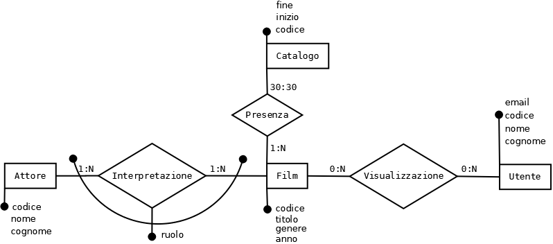

# Soluzione esempio seconda prova [2019 esempio 2](http://esempi.esamidistato.istruzione.it/201819/Istituti%20tecnici/Pdf_er64/ITIA-Esempio2.pdf)
N.B. si riporta la soluzione della sola parte informatica

## Ipotesi aggiuntive
Per la visualizzazione di un film il viaggiatore dovrà comunque fornire le sue credenziali di accesso; questo può porre problemi nel caso di prenotazioni "cumulative" (famiglie o gruppi) ma altrimenti si perde il legame con l'utente. In alternativa si dovrebbe consentire la visione tramite il codice prenotazione; poiché comunque interessa l'utente si decide di trascurare le prenotazioni la cui gestione non è richiesta. Non interessa gestire la durata della visualizzazione né la loro molteplicità.  
Si suppone inoltre che interessi lo storico della composizione del catalogo, ad esempio per evitare che un film rimanga sempre presente.  
Per quanto riguarda l'aggiornamento del catalogo si suppone una frequenza settimanale. Di conseguenza il numero di film potrà essere circa 1500 all'anno.  
Per quanto riguarda il numero di viaggiatori si ipotizza un migliaio al giorno; naturalmente molti utenti faranno più viaggi all'anno.
## Progettazione base di dati
### Legenda notazione utilizzata
Per la notazione utilizzata, vedasi [legenda](../legenda.md)
### Progettazione concettuale
Partendo dalle entità senza le quali il servizio non ha senso, si può scegliere t.

Il diagramma E-R risultante è questo:

## Seconda parte
### III
#### a)
#### b)
#### c) esporre il significato delle varie tipologie di vincoli che si possono riscontrare nella progettazione delle basi di dati e dei riflessi che essi hanno sulle operazioni di inserimento, aggiornamento e cancellazione.
Tipologie di vincoli (in base all'ambito di azione):
1. Vincoli di attributo (un attributo di una riga di una tabella)
   * vincoli di dominio tramite tipo di dato, ad es. INT, DATE, TIME, ...
   * più eventuali restrizioni, ad es. CHECK(age > 0)
   * (im)possibilità di valori NULL
2. Vincoli di tupla (una riga di una tabella)
   * restrizioni su più attributi, ad es. CHECK(total = net + vat)
3. Vincoli interrelazionali (una tabella)
   * chiave primaria (implica NOT NULL), ad es. PRIMARY KEY(user, date)
   * chiave candidata, ad es. UNIQUE(email)
4. Vincoli intrarelazionali (più tabelle)
   * chiave esterna, ad es. FOREIGN KEY(customer) REFERENCES User(id)

Effetti dei vincoli su Insert, Update, Delete:
1. Non è possibile I/U di righe in cui il valore dell'attributo non soddisfi i vincoli
2. Non è possibile I/U di righe in cui i valori degli attributi non soddisfino i vincoli
3. Non è possibile I/U di righe in cui i valori degli attributi siano uguali a quelli presenti in un'altra riga (eventuali righe con valori NULL sono ammesse per UNIQUE)
4. Non è possibile I/U di righe in cui i valori degli attributi siano diversi da quelli presenti in almeno una riga della tabella referenziata (eventuali righe con valori NULL sono ammesse). Inoltre U/D di righe della tabella referenziata possono:
   * essere impediti
   * provocare U/D delle righe dipendenti
   * provocare l'aggiornamento a NULL degli attributi nelle righe dipendenti

